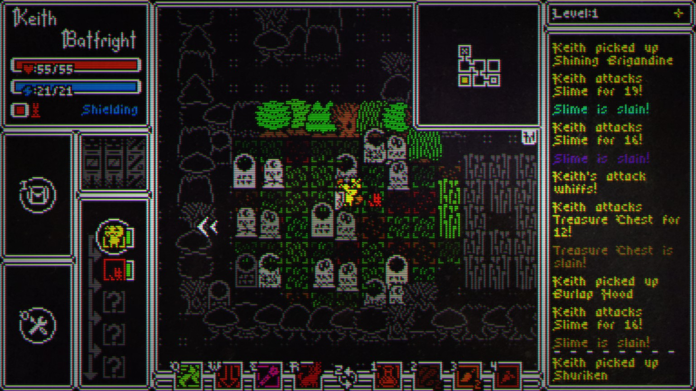

# Haque Research

I was mulling over what kind of a baby roguelike I wanted to make and I remembered Haque :)

_if_ I remember correctly, it has a lot of interesting gameplay elements that I could pull for a very small, very short vertical slice of the early game.

1. compelling role playing with interesting player identities and skills
2. each floor is a grid of connected rooms. Each room comes from some sort of preset templates
3. lots of juice

other stuff that might be interesting to pull from...

1. difficult positioning and combat
2. varied enemies, types, strengths, and weaknesses
3. useful, somewhat scarce items
4. crafting
5. stats
6. more juice

I'm going to play at least one game to get my bearings, then maybe do some internet research to see if I can even potentially create a vertical slice of pared down gameplay in a month or two.

## gameplay

Bahahaha, I forgot how fun the characters are. They are maybe a bit too complex in some ways, especially for what I want to do with my game.

Each character has a :

- modifier (change to stats from the norm for the race)
- race (human, amanita (mushroom), punkin, etc) sets base stats?
- class (sorcerer, burglar, werewolf) sets skills and alters stats
- skills (one by class, one by race?, more by equipment?)
- items (some basic, some set by race, class, etc)
- equipment based on race, class, etc that may grant skills
- pet - not sure what they do, sometimes have special abilities

Stats

- attack
- defense
- accuracy
- evasion
- attack speed
- move speed
- fire, ice, light, and necro affinity

attack order is shown
percent chance to hit is shown as well

Maps seems to be made up of ~9x9 square rooms connected to each other on a grid. The tiles are well defined, but the objects on tiles tend to extend beyond, which makes it feel less boxy

there is FOV, explored objects are shown, but not explored tiles, they match the background

Some rooms are themed (there was a campsite with a fire, a cemetary, a room with tall grass that you can't see through)

There is a minimap

After each level, choose a buff that affects stats or one of your skills

## architecture

I've been thinking and researching design patterns to prep for the project. Roguelikes are generally heavy on the 'data', lighter on all the stuff that godot makes easy, so having some solid foundations to stand on seems like a good idea.

https://www.youtube.com/watch?v=JxI3Eu5DPwE

https://gameprogrammingpatterns.com/

Both the above youtube video and book are by Bob Nystrom. I'm pulling a few things out to try to implement from a structure perspective in this game.

### Items

The idea here is that we use components to represent capabilities of the items. We could also use this for monsters that have special moves.

    class Item {
        Attack melee;
        Attack ranged;
        Defense defense;
        Use use;
    }

    class Attack {
        int minDamage;
        int maxDamage;

        void hit() {...}
    }

    class Defense {
        int armor;
        int dodgeBonus;

        void defend() {...}
    }

    abstract class Use {
        void use();
    }

    class HealUse extends Use {
        void use() {
            hero.health += 20;
        }
    }

    class FireBallUse extends Use {
        void use() {
            // cast fire ball...
        }
    }

    var sword = Item(
        melee: Attack(10, 20));

    var crossbow = Item(
        ranged: Attack(10, 20));

    var shield = Item(
        melee: Attack(5, 8),
        defense: Defense(3, 0));

    var healPotion = Item(
        quaff: HealUse());

    var fireSword = Item(
        melee: Attack(30, 40),
        activate: FireBallUse());

### monsters

The idea here is that we can define types (and sub types) for different breeds of monsters so that we have our own form of inheritance. This will allow us to homogenize some of the code around different monster types, but still have flexibility around how they can work.

    class Monster {
        Breed breed;
        int health;
        int x, y;
    }

    class Breed {
        String name;
        int maxHealth;
        Attack attack;
        List<Use> moves;
        Set<String> flags;
        Drop loot;
    }

### looping

Bob has some interesting ways of implementing turns/actions in the game. He uses the command pattern, where AI or player input will return an action back to the game, which then gets 'performed' by the game loop.

    class Actor {
        int x, y
    }

    class Hero extends Actor {
        HeroClass heroClass;
        // more...
    }

    class Monster extends Actor {
        Breed breed;
        // more...
    }

    abstract class Action {
        ActionResult perform();
    }

    void gameLoop() {
        for (var actor in actors) {
            actor.gainEnergy (actor.speed);
            if (actor.hasEnoughEnergy) {
                var action = actor.takeTurn();
                action.perform();
            }
        }
    }

    class WalkAction extends Action {
        Direction dir;

        ActionResult perform() {
            var pos = actor.pos + dir;

            // see if there is an actor there
            var target = game.stage.actorAt (pos);
            if (target != null) return alternate(AttackAction(target));

            // see if it's a door
            var tile = game.stage[pos];
            if (tile.isDoor) return alternate(OpenDoor(pos));

            // see if we can walk there
            if (!actor.canOccupy(pos)) return fail("You hit the wall!");

            actor.pos = pos;

            // see if the hero stepped on anything interesting
            if (actor is Hero) {
                for (var item in game.stage.itemsAt(pos).toList()){
                    log("You are standing on $item.");
                }
            }

            return succeed();
        }
    }

### patterns

- Components
  - Use components to represent capabilities
- Type Objects
  - define your own type where each instance represents a type
- Command Objects
  - when in doubt, try turning an operation into an object
